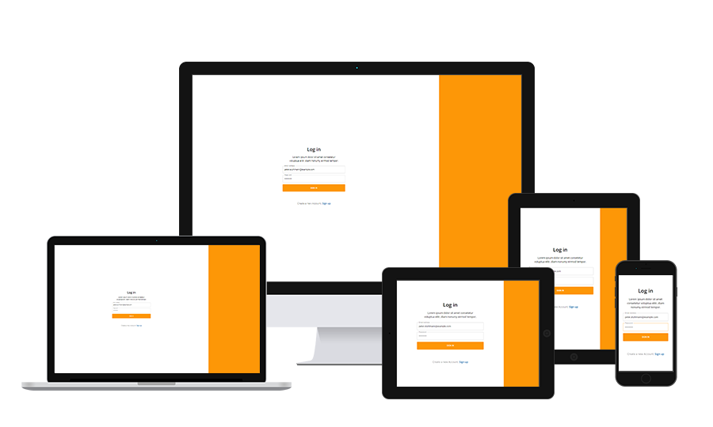

# Log In / Sign Up (UI)

---

## How to run the app

If you want to run this project locally, clone this repository, install node modules with the command `yarn install` and start it with `yarn start`.

---

## License

Licensed under the [MIT](https://github.com/peter-stuhlmann/LoginScreen/blob/master/LICENSE) license by [Peter R. Stuhlmann](https://peter-stuhlmann-webentwicklung.de).
